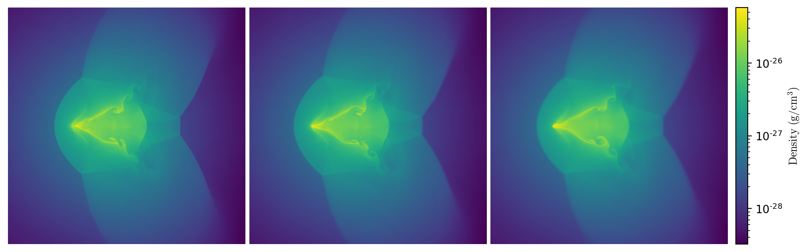
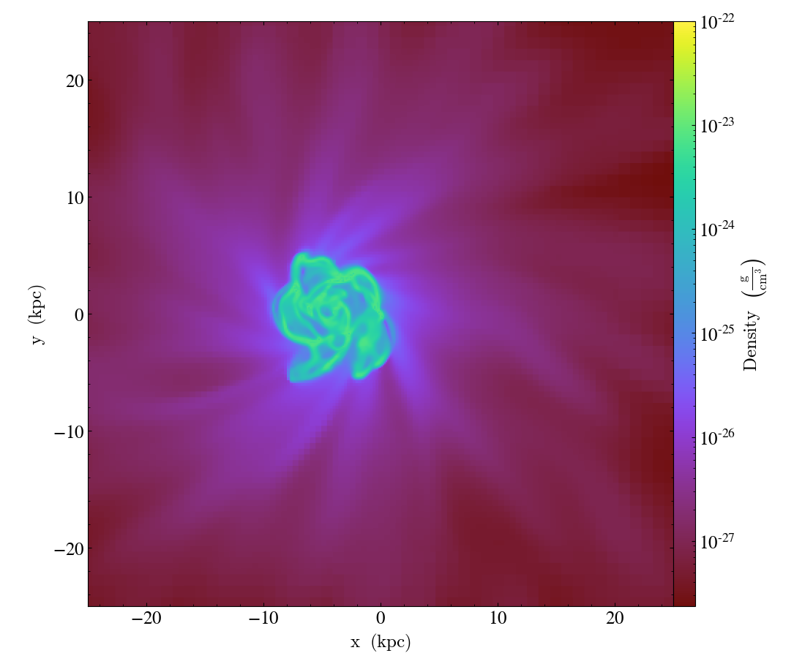

<!-- .slide: class="titleslide" -->

# Data Storytelling and the Grammar of Analysis

## Matthew Turk

<p data-markdown=true>School of Information Sciences<br/>
University of Illinois at Urbana-Champaign<br/>
<tt>mjturk@illinois.edu</tt><br/>
<tt>matthewturk.github.io</tt></p>

---

## Thank you

Before I begin, I want to say thank you for inviting me to give this talk today.

---

## Who Am I

<ul>
<li class="fragment">Computational <b>astrophysicist</b> by training</li>
<li class="fragment">Developed simulation platforms and analysis <b>tools</b> for astrophysics</li>
<li class="fragment">Worked in interdisciplinary applications, study <b>communities</b> of practice in open source scientific software</li>
<li class="fragment">Tenure-track at the School of Information Sciences, developing and implementing a <b>grammar</b> of volumetric analysis
</ul>

---

## Credits: Local

<div class="multiCol">
<div class="col" data-markdown=true>

 <!-- .element: class="headshot" -->

Samantha Walkow <!-- .element: class="headshot-caption" -->

</div>
<div class="col" data-markdown=true>

 <!-- .element: class="headshot" -->

Madicken Munk <!-- .element: class="headshot-caption" -->

</div>
<div class="col" data-markdown=true>

 <!-- .element: class="headshot" -->

Kacper Kowalik <!-- .element: class="headshot-caption" -->

</div>
</div>
<div class="multiCol">

<div class="col" data-markdown=true>

 <!-- .element: class="headshot" -->

Meagan Lang <!-- .element: class="headshot-caption" -->

</div>
<div class="col" data-markdown=true>

 <!-- .element: class="headshot" -->

Jared Coughlin <!-- .element: class="headshot-caption" -->

</div>
<div class="col" data-markdown=true>

 <!-- .element: class="headshot" -->

Chris Havlin <!-- .element: class="headshot-caption" -->

</div>
</div>

---

## Cartoon History of the Universe

<div class="multiCol">
<div class="col">
<div class="fig-container" data-style="height: 600px;" data-file="/2019-12-09-qmc-hamm-research-overview/figures/collapse_heating.html" data-markdown=true>
</div>
</div>
<div class="col" data-markdown=true>
<p class="fragment" data-fragment-index="0">After recombination, the universe was in a nearly-but-not-totally homogeneous state, seeded with instabilities and with a few residual electrons.</p>
<div class="fragment" data-fragment-index="1">
<p>Early-on, dark matter clumps collected and formed "halos," drawing in baryonic material.</p>
<p>This process converted potential energy into thermal energy, heating the baryonic matter, which shed the thermal energy through radiative processes.</p>
</div>
<p class="fragment" data-fragment-index="2">Eventually, this cloud becomes fully-molecular through the three-body interaction and forms an accretion disk.</p>
</div>
</div>

---

## Molecular Hydrogen

<div class="multiCol">
<div class="col" data-markdown=true>
<div class="fig-container" data-style="height: 400px;" data-file="/2019-12-09-qmc-hamm-research-overview/figures/three_body.html" data-markdown=true>
</div>
<div class="fragment" data-fragment-index="1">
$$
\begin{align}
\mathrm{H} + \mathrm{H} + \mathrm{H} & \rightarrow \mathrm{H}_2 + \mathrm{H} \\
\mathrm{H}_2 + \mathrm{H} & \rightarrow \mathrm{H} + \mathrm{H} + \mathrm{H} \\
\mathrm{H}_2 + \mathrm{H} + \mathrm{H} & \rightarrow \mathrm{H}_2 + \mathrm{H}_2 \\
\mathrm{H}_2 + \mathrm{H}_2 & \rightarrow \mathrm{H} + \mathrm{H} + \mathrm{H}_2
\end{align}
$$
</div>
</div>
<div class="col" data-markdown=true>
<p data-markdown=true>In an environment absent heavy elements, the mechanisms by which gas can cool are quite limited.  The principal coolant is molecular hydrogen, which forms first via electron association ($\mathrm{H}^{-}$) and then through three body interactions.</p>
<p class="fragment" data-markdown=true>
This formation channel results in molecular hydrogen that begins in an excited state.
</p>
<p class="fragment" data-markdown=true>
This molecule then quickly de-excites through collisions, resulting in a net heating of the gas by roughly 4.48 eV per molecule.
</p>
</div>
</div>

---

<div style="width: 640px; padding-top:5em;" data-markdown=true>
<h1>We tell lies to visualize.</h1>

<h3 style="text-align:right;">&mdash; Stuart Levy</h3>
</div>

---

<div class="fig-container" data-file="/2020-10-26-visastro-grammar-of-analysis/figures/decoding.html" data-markdown=true>
</div>

---

<!--.slide: data-background-image="https://www.nasa.gov/sites/default/files/thumbnails/image/orion-nebula-xlarge_web.jpg" 
            data-background-size="cover" data-background-repeat="none" -->

---

<div class="fig-container" data-file="/2020-10-26-visastro-grammar-of-analysis/figures/orion_light.html" data-markdown=true>
</div>

---

<!-- .slide: data-background-image="images/clouds.jpg"
             data-background-size="cover" data-background-repeat="none" -->

---

<!-- .slide: data-background-image="https://upload.wikimedia.org/wikipedia/commons/b/bd/Kelvin_Helmholz_wave_clouds.jpg"
             data-background-size="cover" data-background-repeat="none" class="full" -->

<div class="multiCol">
<div class="col" data-markdown=true>
</div>
<div class="col fragment fade-in" style="opacity:0.7;background-color: white;" data-markdown=true>
$$\begin{aligned}{\partial \rho  \over \partial t}+\nabla \cdot (\rho \mathbf{v}) &= 0\\
{\frac {\partial \mathbf {v} }{\partial t}}+\mathbf {v} \cdot \nabla \mathbf {v} +{\frac {\nabla p}{\rho }}&=\mathbf {g}\\
{\partial e \over \partial t}+\mathbf {v} \cdot \nabla e+{\frac {p}{\rho }}\nabla \cdot \mathbf {v} &=0\end{aligned}$$
</div>
</div>

<!--<p class="mediumtext centered"><a href="https://commons.wikimedia.org/wiki/File:Kelvin_Helmholz_wave_clouds.jpg">Brocken Inaglory [CC BY-SA 4.0], via Wikimedia Commons</a></p> -->

---

<div class="multiCol">
<div class="col">
<div class="fig-container" data-style="height: 600px;" data-file="/2020-10-26-visastro-grammar-of-analysis/figures/kh_example.html" data-markdown=true>
</div>
</div>
<div class="col" data-markdown=true>
$$\begin{aligned}{\partial \rho  \over \partial t}+\nabla \cdot (\rho \mathbf{v}) &= 0\\
{\frac {\partial \mathbf {v} }{\partial t}}+\mathbf {v} \cdot \nabla \mathbf {v} +{\frac {\nabla p}{\rho }}&=\mathbf {g}\\
{\partial e \over \partial t}+\mathbf {v} \cdot \nabla e+{\frac {p}{\rho }}\nabla \cdot \mathbf {v} &=0\end{aligned}$$
</div>
</div>

---

# Vocabulary of Data Analysis

<div class="appearing_row" style="margin-top: 1em;">
  <div class="fragment" data-fragment-index=1>
  <div class="right_align">
    <span><i class="fas fa-align-right fa-5x"></i></span>
  </div>
  </div>
  <div class="fragment" data-fragment-index=1>
  <div class="left_align" style="font-size: 200%;">
    Registration
  </div>
  </div>
</div>

<br clear="all"/>

<div class="appearing_row" style="margin-top: 1em;">
  <div class="fragment" data-fragment-index=2>
  <div class="right_align">
    <span><i class="fas fa-calculator fa-5x"></i></span>
  </div>
  </div>
  <div class="fragment" data-fragment-index=2>
  <div class="left_align" style="font-size: 200%;">
    Transformation
  </div>
  </div>
</div>

<br clear="all"/>

<div class="appearing_row" style="margin-top: 1em;">
  <div class="fragment" data-fragment-index=3>
  <div class="right_align">
    <span><i class="fas fa-object-group fa-5x"></i></span>
  </div>
  </div>
  <div class="fragment" data-fragment-index=3>
  <div class="left_align" style="font-size: 200%;">
    Selection
  </div>
  </div>
</div>

<br clear="all"/>

<div class="appearing_row" style="margin-top: 1em;">
  <div class="fragment" data-fragment-index=4>
  <div class="right_align">
    <span><i class="fas fa-mortar-pestle fa-5x"></i></span>
  </div>
  <div class="fragment" data-fragment-index=4>
  <div class="left_align" style="font-size: 200%;">
    Reduction
  </div>
  </div>
</div>

<br clear="all"/>

---

<div class="multiCol">
<div class="col">

# Registration

<p class="fragment">Data is laid out on <b>disk</b> in some manner that may or may not correspond to the spatial organization or physical meaning of what it represents.</p>

<p class="fragment">This data can be laid out in a data structure in <b>memory</b> that represents its logical ordering, with axes and dimensions.</p>

<p class="fragment">Finally, we can register one or multiple datasets in a consistent <b>spatial</b> representation so that we can query fields at specific locations and define $f(\mathbf{x})$.</p>

</div>

<div class="col">
<div class="fig-container" data-file="/2020-10-26-visastro-grammar-of-analysis/figures/volume_layout.html" data-preload data-style="height: 600px;">
</div>
</div>
</div>

---

<div class="multiCol">
<div class="col">

# Registration

<p class="fragment">Given a functional form, discretely sampled data can also be registered for analysis, regardless of its layout on disk.</p>

<div class="fragment" data-markdown=true>
<p>This data may carry with it attributes regarding the density of samples, its neighbors, and fundamental quantities, which can be input into a sampling function over a location.</p>

`$$ A(\mathbf{r}) = \int A(\mathbf{r}')W(|\mathbf{r} - \mathbf{r}'|, h)\mathrm{d} V(\mathbf{r}') $$`
</div>

</div>

<div class="col">
<div class="fig-container" data-file="/2020-10-26-visastro-grammar-of-analysis/figures/particle_layout.html" data-preload data-style="height: 600px;">
</div>
</div>
</div>


---

<div class="multiCol">
<div class="col">
<div class="fig-container" data-file="/2020-10-26-visastro-grammar-of-analysis/figures/galaxy_transformations.html" data-preload data-style="height: 768px;">
</div>
</div>
<div class="col" data-markdown=true>

# Transformations

<p class="fragment">"Primitive" variables: $\rho, \mathbf{v}, e, ...$ can be combined in many different ways to produce fields that exist <i>in potentia</i>.</p>
<p class="fragment">Registration enables combinations at fixed spatial locations.</p>
<p class="fragment">For example, we can apply the arithmetic manipulation:
$$|v| = \sqrt{v_x^2 + v_y^2}$$
</p>
</div>
</div>

---

<div class="multiCol">
<div class="col" data-markdown=true>

# Selection

<p>Points can be filtered based on their connectivity, spatial organization, or criteria from one or more field values.</p>
</div>
<div class="col">
<div class="fig-container" data-file="/2020-10-26-visastro-grammar-of-analysis/figures/kh_operations.html" data-preload data-style="height: 768px;">
</div>
</div>
</div>

---

# Reductions

We can apply reductions along axes, paths and non-trivial manifolds.

<div class="fig-container" data-file="/2020-10-26-visastro-grammar-of-analysis/figures/kh_path.html" data-preload data-style="height: 600px;">
</div>

---

# Composability

<div class="fig-container" data-file="/2020-10-26-visastro-grammar-of-analysis/figures/cosmology.html" data-preload data-style="width: 900px;">

---

# Volumetric Analysis Platform

<div class="multiCol">
<div class="col">

</div>
<div class="col">

The `yt` platform for analysis is a mechanism for abstracting the underlying
operations and building reproducible analysis procedures, independent of data
representation and distribution.  `yt` supports a couple dozen data formats,
from the very big to the very small.

[yt-project.org](https://yt-project.org/)

</div>
</div>

---

## Credits: `yt`

`yt` is a community of users and developers.  The steering committee is made up of:

 * Britton Smith
 * Madicken Munk
 * John ZuHone
 * Stephanie Tonnesen
 * Matthew Turk
 * Cameron Hummels

Two additional folks who have bene extremely active lately I'd like to
recognize are Clément Robert and Corentin Cadiou.

---

## What does yt do?

<p class="">
   `yt` reads data from around O(several dozen) different data formats, regularizes them into a memory model, and then applies semantics to it.
</p>

```bash
$ h5ls galaxy0030/galaxy0030.cpu0000

Grid00000001             Group
Grid00000075             Group
Grid00000076             Group
Grid00000082             Group
Grid00000110             Group
Metadata                 Group
```

---

# Volumetric Analysis Platform

Data-format independent analysis and visualization.



From left, these are GAMER-2, AREPO and GIZMO data outputs, each utilizing different discretization and data ingestion mechanisms.  Image courtesy John ZuHone.

---

## Data Model

The data is indexed, read in as requested, and accessed with respect to *physical* coordinates, rather than computationally-oriented systems.

```python
import yt
ds = yt.load("galaxy0030/galaxy0030")
ds.r[:, :, :].max("density")
ds.r[ (10, 'kpc'):(30, 'kpc'), :, 0.1:0.9 ].integrate("density")
```

It also makes some visualizations and has lots of astro-specific modules.

---

## Current Directions: Visualization

<div class="multiCol">
    <div class="col">
    <p>In collaboration with SPIN studen Aidan Sochowski and iSchool Research Scientist Chris Havlin, we've been building out a typed, data-flow based renderer for adaptive mesh refinement datasets and smoothed particle hydrodynamics simulations.</p>
    <p>In addition, by porting key routines to Rust, we have begun moving some visualization into client-side notebooks for extremely low-latency interactivity.</p>
    </div>
    <div class="col">
        
    </div>
</div>

---

## Current Directions: Grammar

We have to span the entire process from data **acquisition**, to **analysis**,
to **application** to develop understandable information for researchers.

We are implementing this grammar of analysis within `yt`, starting with
high-level operations like visualizations.  We build this on the concepts
developed by precursors such as `vega-lite` (Satyanarayan et al), volume
visualization (Shih et al) and the Grammar of Graphics (Wilkinson), to
encompass the full pipeline of registration, transformation, selection and
reduction as applied to volumetric data.

<div class="multiCol">
<div class="col">

```json
{
    "fields": ["density", "temperature"],
    "axes": ["z"],
    "center": {
        "max": "density"
    },
    "widths": [ [50.0, "kpc"] ],
    "min": {
        "density": {
            "minimum": "density"
        }
    },
    "max": {
        "density": [1e-22, "g/cm**3"]
    }
}
```

</div>
<div class="col">

 <!-- .element: style="max-height: 300px;" -->

</div>

---

<!-- .slide: class="titleslide" -->

# Thank you!

And thanks to funding from the University of Illinois, the Gordon and Betty Moore Foundation, the National Science Foundation, NumFOCUS, and the Foundation for Food and Agriculture Research.
